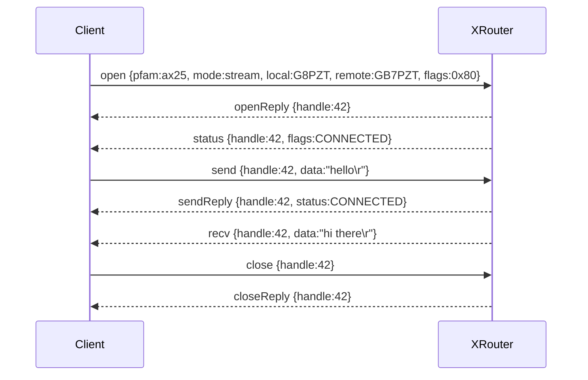
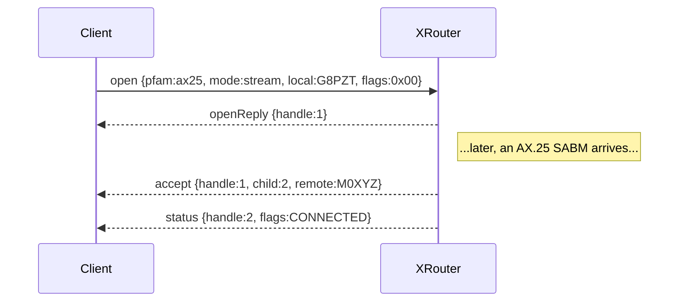

# Protocol primer

This page is a working summary of the RHPv2 wire protocol so you can use
the library effectively without bouncing between specs.  The authoritative
documents are
[PWP-0222](https://wiki.oarc.uk/packet:white-papers:pwp-0222) and
[PWP-0245](https://wiki.oarc.uk/packet:white-papers:pwp-0245).

## Transport

* **TCP**, default port **9000**, persistent connection.
* Optionally **WebSocket** at `ws://{host}:{port}/rhp` (not yet wired up
  in this library).
* **Localhost / RFC1918** clients are admitted without authentication.
* Public clients must send `AUTH` with credentials from XRouter's
  `USERPASS.SYS`.

## Framing

```
┌──────┬──────┬─────────────────────────┐
│ lenH │ lenL │  RHP Message (JSON)     │
└──────┴──────┴─────────────────────────┘
   1B     1B          ≤ 65535B
```

* Two-byte **big-endian** length prefix.
* Total message size **≤ 65 535 bytes**.
* Payload is a **single JSON object** with a string `type` discriminator.

The library implements this in
[`RhpFraming`](library/transport.md#rhpframing).

## Anatomy of a message

Every message is a JSON object.  The required field is `type`; the
optional `id` correlates a request with its reply.  Server-pushed
notifications carry a `seqno` instead.

```json
{
  "type": "open",
  "id": 7,
  "pfam": "ax25",
  "mode": "stream",
  "port": "1",
  "local": "G8PZT",
  "remote": "GB7PZT",
  "flags": 128
}
```

!!! note "If `id` is omitted"
    The spec says the server only replies on error.  The library
    auto-assigns ids on every request method, so successful replies always
    come back to your `await`.

## Message catalogue

### Connection management

| Type        | Direction | Purpose                                     |
|-------------|-----------|---------------------------------------------|
| `auth`      | C → S     | Credentials for non-LAN clients.            |
| `authReply` | S → C     | `errCode` 0 (Ok) or 14 (Unauthorised).      |
| `open`      | C → S     | Combined create + connect/listen.           |
| `openReply` | S → C     | Allocates a socket `handle`.                |
| `accept`    | S → C     | Inbound connection on a listener.           |
| `close`     | C ↔ S     | Tear down a socket.                         |
| `closeReply`| S → C     | Acknowledge close.                          |

### BSD-style lifecycle

`socket` → `bind` → `listen` / `connect` → … → `close`, each with its
own reply.  Useful when you need finer control than `open` provides.

### Data transfer

| Type            | Direction | Purpose                                              |
|-----------------|-----------|------------------------------------------------------|
| `send`          | C → S     | Outbound stream / dgram payload.                     |
| `sendReply`     | S → C     | Acknowledgement (carries STREAM status flags).       |
| `sendto`        | C → S     | Outbound datagram with explicit dest.                |
| `sendtoReply`   | S → C     | Acknowledgement.                                     |
| `recv`          | S → C     | Inbound payload (or trace frame).                    |

### Status

| Type           | Direction | Purpose                                       |
|----------------|-----------|-----------------------------------------------|
| `status`       | both      | C→S query; S→C async link state.              |
| `statusReply`  | S → C     | Returned only on query failure.               |

## Protocol families & socket modes

| Family   | Layer | Use cases                                      |
|----------|-------|------------------------------------------------|
| `unix`   | 7     | XRouter CLI / app sockets.                     |
| `inet`   | 3-4   | TCP / UDP / ICMP / IP / DNS.                   |
| `ax25`   | 2     | AX.25, APRS, digipeating.                      |
| `netrom` | 3-4   | NetRom datagrams & streams.                    |

| Mode      | Notes                                       |
|-----------|---------------------------------------------|
| `stream`  | Ordered, reliable octet stream.             |
| `dgram`   | Unreliable datagram.                        |
| `seqpkt`  | Sequenced reliable packets (AX.25).         |
| `custom`  | User-specified protocol.                    |
| `semiraw` | Addresses + raw payload.                    |
| `trace`   | Decoded headers + payload (monitoring).     |
| `raw`     | Complete raw packet.                        |

## Flag bitfields

### `OpenFlags` (in `open` / `listen`)

| Bit  | Name              | Meaning                                |
|------|-------------------|----------------------------------------|
| 0x00 | Passive           | Listener (default).                    |
| 0x01 | TraceIncoming     | Trace incoming frames (RAW/TRACE).     |
| 0x02 | TraceOutgoing     | Trace outgoing frames (RAW/TRACE).     |
| 0x04 | TraceSupervisory  | Include AX.25 S-frames (TRACE only).   |
| 0x80 | Active            | Perform a connect.                     |

### `StatusFlags`

| Bit | Name      | Meaning                                |
|-----|-----------|----------------------------------------|
| 1   | ConOk     | OK to accept (listeners).              |
| 2   | Connected | Downlink up.                           |
| 4   | Busy      | Not clear to send (flow control).      |

## Address formats

| Family  | Format                                     | Example             |
|---------|--------------------------------------------|---------------------|
| `ax25`  | callsign with optional SSID                | `G8PZT-1`, `GB7GLO` |
| `netrom`| `<usercall>[@nodecall][:svcnum]`           | `G8PZT-1@G8PZT`     |
| `inet`  | `<ip>[:port]`                              | `192.168.3.22:25`   |

## Error codes

The library exposes these as `RhpV2.Client.Protocol.RhpErrorCode.*` and
surfaces non-zero replies via [`RhpServerException`](library/errors.md).

| Code | Text                       |
|------|----------------------------|
| 0    | Ok                         |
| 1    | Unspecified                |
| 2    | Bad or missing type        |
| 3    | Invalid handle             |
| 4    | No memory                  |
| 5    | Bad or missing mode        |
| 6    | Invalid local address      |
| 7    | Invalid remote address     |
| 8    | Bad or missing family      |
| 9    | Duplicate socket           |
| 10   | No such port               |
| 11   | Invalid protocol           |
| 12   | Bad parameter              |
| 13   | No buffers                 |
| 14   | Unauthorised               |
| 15   | No Route                   |
| 16   | Operation not supported    |
| 17   | Not connected †            |

† `Not connected` (`errCode:17`) isn't in the published table but
xrouter emits it on `send` against a stream socket whose AX.25
downlink isn't (yet, or any longer) connected.  The library exposes
it as `RhpErrorCode.NotConnected`.

## Spec quirks the library tolerates

This is the raw list of spec-vs-reality deltas the library papers over.
For the design consequences — and some ideas for a future protocol
revision — see the [protocol field notes](protocol-field-notes.md).

* **All** replies use `errCode`/`errText` (capital C/T) on the wire.
  PWP-0222 / PWP-0245 only mentions this as a quirk of `AUTHREPLY`, but
  integration testing against the real xrouter
  (`ghcr.io/packethacking/xrouter`) shows every reply uses the
  capitalised form.  The library reads case-insensitively (so the
  lowercase form from the spec also works) and writes the capitalised
  form so the mock server matches real xrouter byte-for-byte.
* PWP-0222 spells the connect reply type as `ConnectReply` (PascalCase).
  The library writes `connectReply` (camelCase) — and reads either.
* **`connectReply.errCode` mirrors `handle` on success.**  Real xrouter
  responds to a successful `connect` with a reply where `errCode` is the
  same integer as `handle` (rather than 0), but `errText` is `"Ok"`.
  The library treats any `connectReply` with `errText="Ok"` as success
  regardless of the numeric code, so applications don't see spurious
  `RhpServerException` throws.  Real failures (e.g. `errText="No Route"`,
  `errText="Not bound"`) still raise as expected.
* AX.25 connect is asynchronous: the `connectReply` arrives immediately
  after the API call, but the actual SABM/UA handshake hasn't happened
  yet.  The handshake outcome is reported later via `status` notifications
  (`flags=Connected` on success, link state changes thereafter).
* Unknown `type` values surface as `UnknownMessage`, preserving the raw
  JSON for forward compatibility.  The real xrouter happens to manufacture
  a reply for unknown types by appending `Reply` to whatever string it
  received (e.g. `foo` → `fooReply` with `errCode:2`); the library
  surfaces such replies as `UnknownMessage` (since the type discriminator
  doesn't match anything it knows).
* `RHPPORT=9000` must appear in `XROUTER.CFG` for xrouter to bind the RHP
  listener on the Linux stack — without an explicit directive, the dummy
  loopback config doesn't open the port.
* Socket handles allocated via `socket` / `open` are *globally* numbered
  inside xrouter, not scoped per TCP connection.  Two clients can see
  monotonically-related handles, and (with care) a handle allocated by
  one connection can be referenced by another.  Treat handles as opaque
  and don't rely on isolation.
* When a connection sends a bad `auth` request, **every subsequent
  request on that same TCP connection** is answered with
  `authReply`/`errCode:14`, regardless of its actual `type`.  Reconnect
  to recover.
* **`accept.port` is a JSON string**, not the unquoted number the
  PWP-0222 example shows.  Real xrouter emits `"port":"2"` on
  `accept`.  The library types `AcceptMessage.Port` as `string?` and
  reads either shape.
* **`recv.port` shape varies by mode**: TRACE emits an unquoted
  number (`"port":1`), DGRAM emits a quoted string (`"port":"2"`).
  Same field name, two wire shapes.  The library normalises to
  `string?` and reads either.
* TRACE-mode `recv` frames carry several fields the spec doesn't
  enumerate: `tseq` (transmit sequence), `ilen` (info-field length),
  `pid` (AX.25 PID byte), `ptcl` (decoded protocol name).  All
  exposed on `RecvMessage`.
* **`send.data` above ~8 KB is silently dropped** — no `sendReply`,
  no notification, the RHP TCP connection stays open.  The cliff
  sits between 8100 and 8200 bytes.  Below that, behaviour is normal;
  above, callers that `await` `sendReply` will hang.  Fragment
  client-side if you need larger payloads.

## Lifecycle examples

### Outgoing AX.25 keyboard session



### Incoming listener


